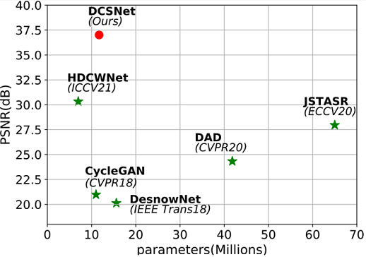
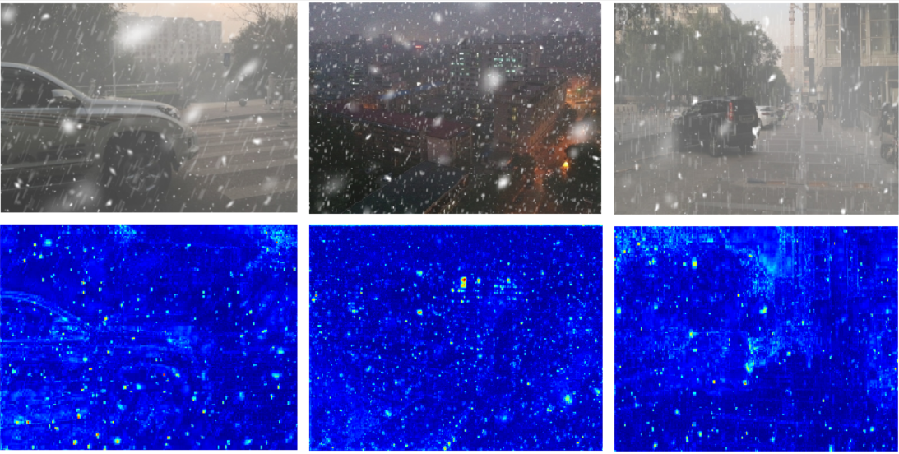

**Toward Snow Removal via the diversity and complexity of Snow Image**
---
####  **Yan Shen**, **Jiange Xu** , **Xiaotao Shao** , **Jinbiao Zhu** and **Xinmin Wang**

**This repo is an implementation of PyTorch version.**



Image desnowing on the CSD dataset. Under different parameter capacities(x-axis), our approach performs better than other methods, as well as the stat-of-the-art(PSNR on y-axis)


### Feature maps display of AFFP module:



It shows that the network structure is focused on the various elements of the snowflake.

### The ablation experiments of the PRM module on hyperarameters are follows:

* ***T*** : the number of stages of PRM

* ***n*** : the number of  CAB

| &nbsp;&nbsp;&nbsp;&nbsp;T&nbsp;&nbsp;&nbsp;&nbsp; | &nbsp;&nbsp;&nbsp;&nbsp;PSNR&nbsp;&nbsp;&nbsp;&nbsp;  | &nbsp;&nbsp;&nbsp;&nbsp;SSIM&nbsp;&nbsp;&nbsp;&nbsp; | &nbsp;&nbsp;&nbsp;&nbsp;GFLOPs&nbsp;&nbsp;&nbsp;&nbsp; |
| :-----------------------------------------------: | :---------------------------------------------------: | :--------------------------------------------------: | :----------------------------------------------------: |
| &nbsp;&nbsp;&nbsp;&nbsp;1&nbsp;&nbsp;&nbsp;&nbsp; | &nbsp;&nbsp;&nbsp;&nbsp;34.25&nbsp;&nbsp;&nbsp;&nbsp; |   &nbsp;&nbsp;&nbsp;&nbsp;0.96&nbsp;&nbsp;&nbsp;&nbsp;   |  &nbsp;&nbsp;&nbsp;&nbsp;62.2&nbsp;&nbsp;&nbsp;&nbsp;  |
| &nbsp;&nbsp;&nbsp;&nbsp;2&nbsp;&nbsp;&nbsp;&nbsp; |   &nbsp;&nbsp;&nbsp;&nbsp;&nbsp;&nbsp;&nbsp;&nbsp;    |   &nbsp;&nbsp;&nbsp;&nbsp;&nbsp;&nbsp;&nbsp;&nbsp;   |  &nbsp;&nbsp;&nbsp;&nbsp;72.8&nbsp;&nbsp;&nbsp;&nbsp;  |
| &nbsp;&nbsp;&nbsp;&nbsp;3&nbsp;&nbsp;&nbsp;&nbsp; | &nbsp;&nbsp;&nbsp;&nbsp;36.14&nbsp;&nbsp;&nbsp;&nbsp; | &nbsp;&nbsp;&nbsp;&nbsp;0.98&nbsp;&nbsp;&nbsp;&nbsp; |  &nbsp;&nbsp;&nbsp;&nbsp;83.4&nbsp;&nbsp;&nbsp;&nbsp;  |
| &nbsp;&nbsp;&nbsp;&nbsp;4&nbsp;&nbsp;&nbsp;&nbsp; |   &nbsp;&nbsp;&nbsp;&nbsp;&nbsp;&nbsp;&nbsp;&nbsp;    |   &nbsp;&nbsp;&nbsp;&nbsp;&nbsp;&nbsp;&nbsp;&nbsp;   |  &nbsp;&nbsp;&nbsp;&nbsp;94.0&nbsp;&nbsp;&nbsp;&nbsp;  |

|&nbsp;&nbsp;&nbsp;&nbsp;n&nbsp;&nbsp;&nbsp;&nbsp;|&nbsp;&nbsp;&nbsp;&nbsp;PSNR&nbsp;&nbsp;&nbsp;&nbsp;|&nbsp;&nbsp;&nbsp;&nbsp;SSIM&nbsp;&nbsp;&nbsp;&nbsp;|&nbsp;&nbsp;&nbsp;&nbsp;GFLOPs&nbsp;&nbsp;&nbsp;&nbsp;|
| :--: | :---: | :--: | :----: |
|&nbsp;&nbsp;&nbsp;&nbsp;2&nbsp;&nbsp;&nbsp;&nbsp;|&nbsp;&nbsp;&nbsp;&nbsp;34.40&nbsp;&nbsp;&nbsp;&nbsp;|&nbsp;&nbsp;&nbsp;&nbsp;0.96&nbsp; &nbsp;&nbsp;&nbsp;|&nbsp;&nbsp;&nbsp;&nbsp;75.7&nbsp;&nbsp;&nbsp;&nbsp;|
|&nbsp;&nbsp;&nbsp;&nbsp;4&nbsp;&nbsp;&nbsp;&nbsp;|&nbsp;&nbsp;&nbsp;&nbsp;36.14&nbsp;&nbsp;&nbsp;&nbsp;| &nbsp;&nbsp;&nbsp;&nbsp;0.98&nbsp;&nbsp;&nbsp;&nbsp;|&nbsp;&nbsp;&nbsp;&nbsp;83.4&nbsp;&nbsp;&nbsp;&nbsp;|
|&nbsp;&nbsp;&nbsp;&nbsp;6&nbsp;&nbsp;&nbsp;&nbsp;|&nbsp;&nbsp;&nbsp;&nbsp;&nbsp;&nbsp;&nbsp;&nbsp;|&nbsp;&nbsp;&nbsp;&nbsp;&nbsp;&nbsp;&nbsp;&nbsp;|&nbsp;&nbsp;&nbsp;&nbsp;91.1&nbsp;&nbsp;&nbsp;&nbsp;|


### Explore transferability across different datasets

The following experiments take the model trained on the CSD dataset as the baseline, and perform direct transfer or fine-tuning on **SRRS/ Snow100K**. Here, we benchmark against the **PSNR** metric.

| dataset  | direct transfer | fine-tuning | retrain |
| :------: | :-------------: | :---------: | :-----: |
|   SRRS   |      30.29      |    30.94    |  31.25  |
| Snow100K |      26.80      |    32.89    |  33.64  |


**Please note that the network structure source code will not be open source until our paper is accepted.**

### Installation

This implementation based on [BasicSR](https://github.com/xinntao/BasicSR) which is a open source toolbox for image/video restoration tasks. 

```python
python 3.8.0
pytorch 1.8.0
cuda 11.1
```

```
pip install -r requirements.txt
python setup.py develop --no_cuda_ext
```

### Quick Start (Single Image Inference)

---

* ```python basicsr/demo.py -opt options/demo/demo.yml```

  * modified your input and output path
  * define network
  * pretrained model, it should match the define network.

     

### Image Desnow Tasks

---

Image Desnow - CSD dataset 


* prepare data

  * ```mkdir ./datasets/CSD ```
  
  * download dataset
  * it should be like:
  
    ```bash
    ./datasets/CSD/
    ./datasets/CSD/train/
    ./datasets/CSD/train/input/
    ./datasets/CSD/train/target/
    ```
  
  * ```python scripts/data_preparation/csd.py```
  
    * crop the train image pairs to 256x256 patches.


* eval
  * ```python basicsr/test.py -opt options/test/CSD/DCSNet.yml  ```

* train

  * ```python -m torch.distributed.launch --nproc_per_node=2 --master_port=4321 basicsr/train.py -opt options/train/CSD/DCSNet.yml --launcher pytorch```
  * data in lmdb format will lose about 0.01 value in PSNR

